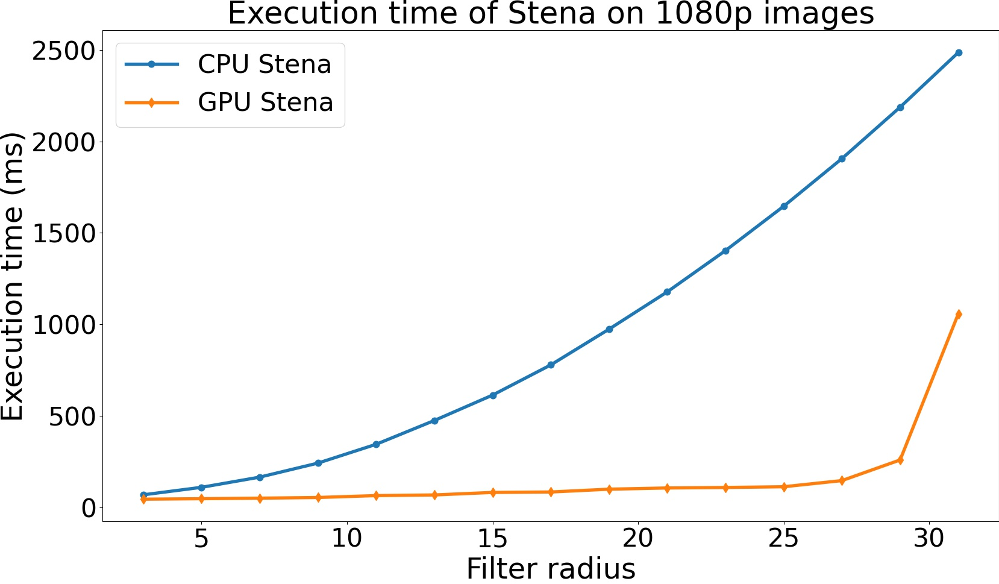
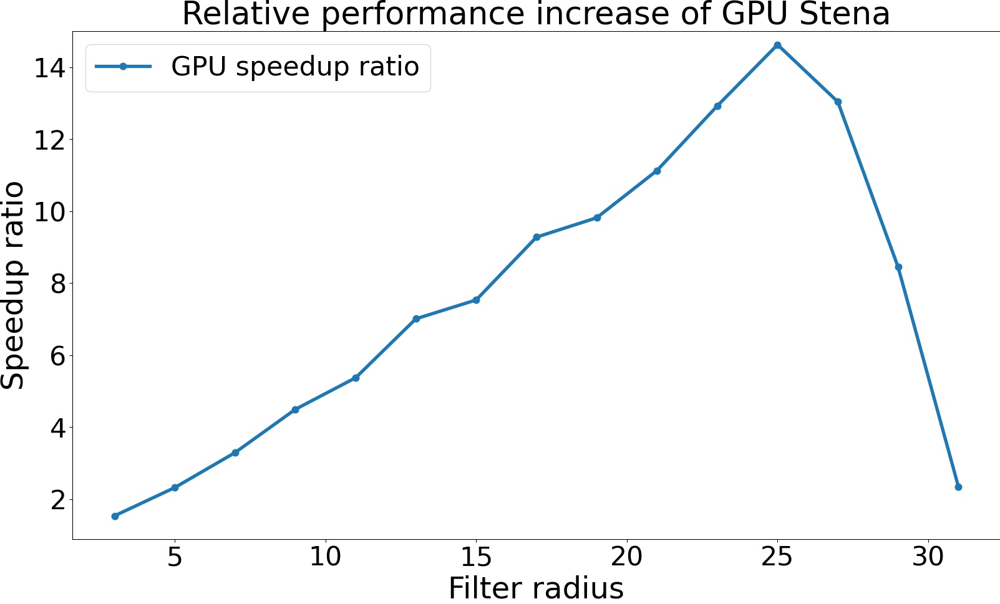
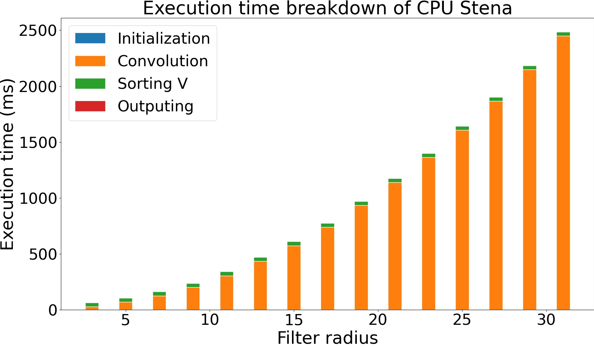
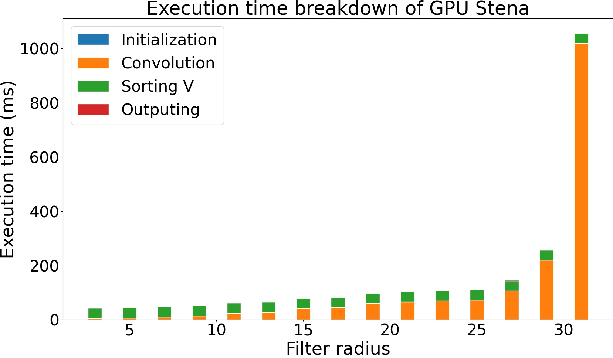

# steganography
Steganography implementation using cuda

First, to compile, extract the `.zip` file and use the following command:

```bash
nvcc main.cu stena_gpu.cu auto_tester.cu ppm_lib.cpp stena_cpu.cpp --machine 64 -o stena
```

Or using makefile with:
```bash
make all
```

Then, run the program.
```bash
./stena
```

## How to run


## Benchmark





