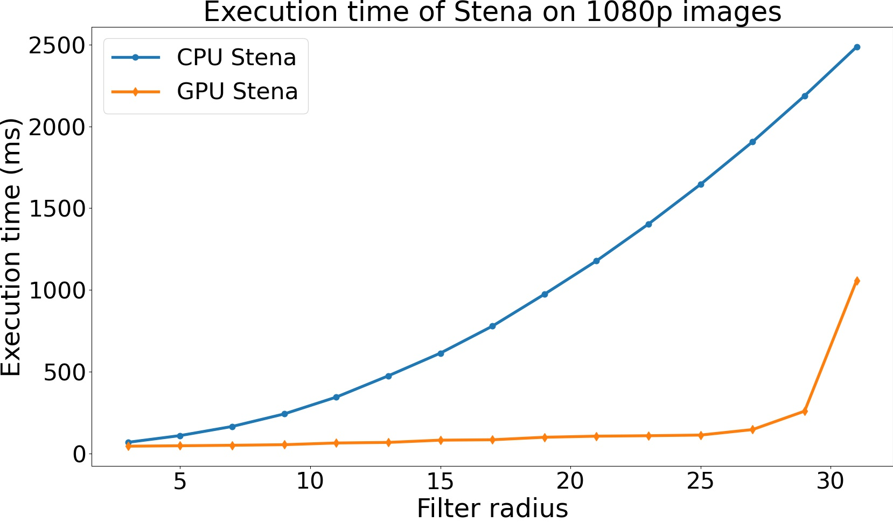
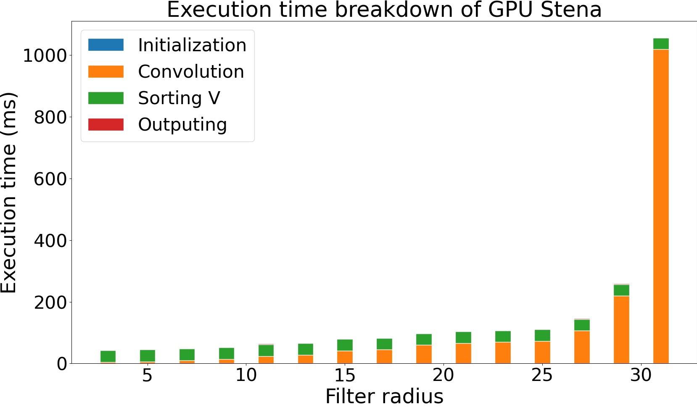

---
title: "Steganographie"
author: \textbf{DO Duy Huy Hoang} \newline
        \textbf{Nguyen Thi Mai Phuong} \newline
        \newline
        \newline
        \textit{University of Limoges} \newline 
date: \today
titlepage: false
header-includes: |
    \usepackage{multicol}
    \usepackage{graphicx}
footer-left: Do Hoang et Mai Phuong
mainfont: NewComputerModern
sansfont: NewComputerModern
monofont: Dank Mono
caption-justification: centering
...
\pagenumbering{Roman} 

\newpage{}

\listoffigures
\newpage{}
\tableofcontents
\newpage{}

\pagenumbering{arabic} 

# Introduction 

## Context and Motivation

Steganography is a method of hiding message, file, or even image inside another message, file or image. 
The advantage of Steganography in the cryptology field is that we can concealing an cipher encrypted text inside an image without alter the original picture drastically.

## Objectives

We denote Steganographie as **Stena**, for short.

In this project, we have done the following:

- Stena with CPU
- Stena with `GPU` and `CUDA` (5-15x faster) using shared memory
- Hiding multiple characters in an image
- Can use filter any size (with width, height `<=` 31, odd numbers)
- Automated testing for correctness and speed
  - Benchmark at the end

# Technical details

In this part, we highlight the important ideas and implementation details in the program. Note that this section is about CPU version, the GPU version will be explained later.

Overall, Stena is divided into 4 main phases:

- **Initialization**: We allocate memory for the arrays we use during computation
- **Convolution**: the filter is convoluted with the image to create image V. Pixel of V at the border (that cannot fit the filter) will have value 0
- **Sorting**: 8*n pixels with the largest values in V is selected, where `n` is the length of the input string. Each pixel will contain 1 bit of that string
- **Output**: given 8*n positions, the characters are hidden in the original image using the described method

The convolution section is the most important part in this project. The final two is self-explanatory in the source code.

## Utilities functions

- We use `ppm_lib.h` for image reading/write. Since the memory does not include any memory management, we have to allocate/free memory manually
- For measuring time, we use C++ `chrono` libraries. The utility class is implemented in `my_timer.h`
- Definitions of important variables:
    - **H, W**: height and width of the image
    - **M, N**: height and width of the filter
    - **n**: length of the hidden string
    - `K = 8*n`: the number of pixels needed to hide the string, 1 bit per pixel

## Convolution 

The CPU implementation is straightforward. We loop over each pixel (i,j) and place the center of the filter on top of it. Then, we loop over each cell of the filter to compute the convolution sum. That sum will be the new value of V(i,j) 

Note that for pixels at the border, the filter cannot fit inside the image. In that situation, `V(i,j) = 0`.

Time complexity: `O(H*W*M*N)`

## Sorting

In this part, we need to find 8*n pixels (i,j) with the largest V(i,j).

The simplest way to this is to create an array size `H*W`, where each element contains a value V(i,j) and its index in array V (which is implemented as a 1D array, like `PPMImage`). After that, we sort the array decreasingly and choose the first `8*n` pixel position to hide the string. 

Time complexity for sorting is: `O(H*W*log(H*W))`

This is wasteful because `n << H*W`. For example, for a 1080p images, there are 1920*1080 = 2073600 pixels to sort. If we want to hide a 10-character string, we only need the largest 80 pixels. Sorting the entire array is a waste.

Therefore, we use `QuickSelect algorithm` to partially fort and find only the K largest elements. This is a popular and common algorithm, and more details can be seen in the code's comments.

Time complexity: Approximate `O(H*W*log(K))`

## Output 

This section is straightforward. For each character in the string, we hide each of its bit in the Least-significant Bit of the selected pixels, starting from the pixel with the largest V(i,j). The method is exactly the same as the project's description.

Using bit-wise operations, it is simple to manipulate the bits of a number. More details can be found in the code's comments, inside function `hideString()` and `getString()` of file `stena_cpu.cpp`.

### Hide String

Hide j-th bit of the character in the LSB of this pixel
```c++
res->data[pixelIndex].blue &= ~byte(1);
```
`byte(1) = 00000001 -> ~byte(1) = 11111110` `->` this turns off bit 0
```c++
res->data[pixelIndex].blue |= (s[i] >> j) & 1; 
```
Set bit 0 to the j-th bit of character s[i]

### Read string

Reads bit 0 at this pixel position and update c `(x & 1)` get bit 0 of x 
`c |= (1 << j)` turns on j-th bit of c; `c |= (0 << j)` do nothing
```c++
c |= (image->data[pixelIndex].blue & 1) << j;
```

# Implementation GPU

## Methods

We only use GPU acceleration for convolution. For sorting and outputting, we use the same functions from the CPU version. Since convolution accounts for the overwhelming majority of the execution time, this improvement still speedups the program greatly.

To calculate the V matrix, we are using this formula:
\begin{center}
$V_{i,j} = \displaystyle\sum_{m\in[i-1, i+1], n\in[j-1,j+1]}(r_{m,n}+g_{m,n})* filtre_{m-i,n-j})$
\end{center}

We used Tiled 2D Convolution, which uses Shared memory to improve speed. The idea is from [*this lecture*](http://www.cs.ucr.edu/~nael/217-f15/lectures/217-lec8.pdf). In this project, we assume the filter sizes satisfy: `M, N <= 31`

We define 2 new variables:

- rowpb = TILE_DIM – M + 1: the number of rows a block process
- colpb = TILE_DIM – N + 1: the number of columns a block process

### Data formatting

In the `ppm_lib.h` library, a Pixel is represent by a struct:

```c
struct PPMPixel {
    unsigned char red, green, blue;
}
```

However, in the GPU version, we use raw array of bytes. That means 3 consecutive elements in the array represent 1 pixel. For comparison, in an array of pixels, we do the following to access the color channels of the i-th pixel:

- PPMPixel: `a[i].red, a[i].green, a[i].blue`
- Raw data: `a[3*i], a[3*i+1], a[3*i+2]`

We do this for simplicity, and because raw data is easier to handle in kernel code.

### Kernel call configuration
Our kernel launch blocks of 32×32 threads, `TILE_DIM=32` in the code, each block processes a tile of size rowpb × colpb pixels. 
Each block processes `colpb` continuous columns. After it finishes with the first rowpb rows, it moves on to the next rows, and so on. Therefore, we need to launch enough blocks to cover all columns, which equals to: `roundup(W / colpb)`.
Each thread correspond to one pixel, the filter's top-left corner is placed at `(myrow, mycol)`. So that `thread (tidx,tidy)` has input `(myrow, mycol)` and output to pixel `V[myrow + filtH/2][mycol + filtW/2]`.
Each block process `(TILE_DIM - filtW + 1)` columns (draw an image to imagine).
To process imgW column, need `roundup(imgW / (TILE_DIM-filtW+1))` blocks.
To process entire image, each block loop over rows:

- process rows 0...x, x+1...2x, 2x+1...3x,...; where x = TILE_DIM - filtH + 1

The kernel launch looks like this:

```c
int columnsPerBlock = TILE_DIM - filtW + 1; 
dim3 grid((imgW + columnsPerBlock - 1) / columnsPerBlock, 1, 1);
dim3 block(TILE_DIM, TILE_DIM, 1);
myconv2dCuda << < grid, block, 2 * filtH * filtW * sizeof(float) >> >
    (imgH, imgW, gdata, filtH, filtW, gfilter, gV);
```

### Loading data into shared memory 

In Tiled 2D convolution, first we define a 2D array for shared memory, called *smem*. 

```c++
__shared__ float smem[TILE_DIM][TILE_DIM];
```

Then, we need to define some variables (more details in the code comment).

```c
// rowsPerBlock = TILE_DIM - filtH + 1; Formula: roundup(a/b) = (a + b - 1) / b.
const int loop = (imgH + (TILE_DIM - filtH + 1) - 1) / (TILE_DIM - filtH + 1),
          stride = TILE_DIM - filtH + 1,
          halfH = filtH / 2, halfW = filtW / 2;
const int mycol = blockIdx.x * (TILE_DIM - filtW + 1) + tidy,
          mycolOut = mycol + halfW;
int myrow = tidx, myrowOut = tidx + halfH;
```

Recall that at each step, a block process rowpb rows of array V. So, loop is the number of steps needed to compute H rows of the image.
For each block, the first thing to do is loading data from global memory (the image) into shared memory. 
Since we launch blocks of 32×32 threads, which match smem exactly, loading data is very simple.

```c
// load image data to shared memory
if (mycol >= imgW || myrow >= imgH) smem[tidx][tidy] = 0;
else {
    int pixelPos = 3 * cell(myrow, mycol, imgW);
    smem[tidx][tidy] = pixels[pixelPos] + pixels[pixelPos + 1]; // red, green
}
__syncthreads();
```

The variables myrow, mycol represent the current pixel position of a thread. The **top-left** corner of the filter is placed on this position (unlike the center of the filter in the CPU version). Therefore, if it’s outside of the image, its value is 0. Otherwise, we read its value from the global memory to shared memory.

**Note**: cell(i,j,w) = i*w + j. Given the row and column of a pixel, this macro turns it into the actual address of the pixel in the data array.

### Convolution and output
For each thread, the top-left corner of the filter is placed at (myrow, mycol). Therefore, the output pixel is placed at (myrowOut, mycolOut), which is shown in the second image of the previous subsection.
**Note** that all threads in a warp access the same `filter[cell(i,j,filtW)]` at all steps, so that we use constant memory for better speed.

```c
 if (tidx < TILE_DIM - filtH + 1 && tidy < TILE_DIM - filtW + 1 &&
     // the top-left corner of the filter is put here, and it must fit inside the tile.
     myrowOut < imgH - halfH && mycolOut < imgW - halfW) // It must output to a pixel position inside the image
 {
     float tmp = 0;
     for (int i = 0; i < filtH; i++)
         for (int j = 0; j < filtW; j++)
             tmp += smem[tidx + i][tidy + j] * filter[cell(i, j, filtW)];

     V[cell(myrowOut, mycolOut, imgW)] = tmp;
 }

 // update indexes
 myrow += stride;
 myrowOut += stride;
```

Finally, convolution is very simple. First, we only consider threads that can fit the filter inside the image and outputs to a pixel inside the image.
Then, each thread loop over the filter and multiply it with the corresponding pixel (in shared memory). We noticed that all threads in a warp always access the same element of the filter at each step in this loop, so the filter is put in **constant memory** for better performance. By doing this, instead of reading the data serially, the GPU can issue a **broadcast**, meaning all threads get the required data immediately. 
Finally, the corresponding pixel `V(myrowOut, mycolOut)` is updated, and blocks move on to process the next set of rows.

### Other steps

After computing V, the sorting and outputting sections use the same CPU functions as the CPU Stena version. 

### Auto testing

We have developed a proper way for testing the correctness and also speed of our Stena implementation by generating images and compare the results of the GPU version with CPU version as well as checking that the encryption/decryption process outputs the original message.

If a parameter `(imgH, imgW,...)` is <= 0, it is randomly generated. 

    - Parameters: number of tests, image height/width, filter height/width (must be odd number <= 31)

```c++
void testCorrectness(int ntest, int imgH = -1, int imgW = -1, int filtH = -1, int filtW = -1);

void testSpeed(int ntest, int imgH = -1, int imgW = -1, int filtH = -1, int filtW = -1);
// - Parameters: number of test, image height/width, filter height/width (must be odd number <= 31),
// use CUDA or not.
// This will benchmark ntest times (might takes hours) and store the average run time in a file.
void benchmark(int ntest, int imgH, int imgW, int filtH, int filtW, bool useCuda = false);
```

## Benchmark results
For benchmarking, we use FullHD images (1920x1080) because this is a very common resolution. We measure the execution time of Stena at different filter radius (for benchmarking, we use square filters).

The benchmark is done on a computer with 8750H CPU at 3.1GHz, 16GB dual-channel 2666MHz DDR4, 1060 6gb, and Arch Linux. The program is compiled in Clion (all optimizations on).

### Execution time comparison

You can easily see that the CPU version’s running time has quadratic growth with respect to the filter radius. Meanwhile, the GPU version is very fast in most cases.



However, when the filter grows near to 31x31, it becomes much slower. This is because we use block size 32x32 for the Tiled Convolution, so when the filter is too large, a large amount of time is spent on copying data to shared memory instead of computing

### Relative performance speedup:

From part Execution time comparison, we get the following graph.


### Execution time breakdown – CPU version

Recall that Stena contains 4 main part: initialization, convolution, sorting, and outputting. The graph below shows how much time is spent on each part.


We easily see that convolution takes up the overwhelming majority of the execution time. That means we get a huge speedup even if we only accelerate this step.

### Execution time breakdown – GPU version



Thanks to GPU acceleration, now convolution takes much less time. However, the time it takes to sort V is still the same.
Since we use a fixed tile size of 32x32, and the number of rows/columns that are processed by a block at each step is rowpb, colpb. When the filter is large (near 31), rowpb/colpb are very small and most of the time is spent on copying data from global memory to shared memory. This explains why the execution time suddenly becomes so large near the end.

# Conclusion

In this project we used the parallel architecture of GPU as a solution for performing a Steganography program with the support of CUDA. Yet, there is still a lot of things for improvement for this project, the task that we archived in this project are described as follow:

- Made both Stena CPU and GPU version, with automated testing
- GPU version is considerably faster
- Bonus: can hide multiple characters
- Bonus: can work with many filter sizes (including non-square filters)
- Bonus: find n number values elements with largest values, then output their index using `quicksort` and `quickselection`

# Demo

First, to compile, extract the `.zip` file and use the following command:

```bash
nvcc main.cu stena_gpu.cu auto_tester.cu ppm_lib.cpp stena_cpu.cpp --machine 64 -o stena
```

Or using makefile with:
```bash
make all
```

Then, run the program.
We use a simple console UI with keyboard input to demo our project.


We included several images in our submission for you to test.


**1. Encrypting an image:**


You need to type in the hidden message, an image file to hide the image, and a filter seed. The seed is used to generate a filter and it acts like a password (a same seed will generate the same file).
The program will hide your message in a new image; you can see its name in the last line `Encrypted in file ___.ppm`
On the left is the original image (1.ppm). On the right, the message “hello world” is hidden inside using the filter seed 25. You can see that they’re nearly identical.

To change filter size, you can change it on `demo.h` file.

**2. Decrypting an image**


You need to input the name of the encrypted image and the filter seed. Then, the program will decrypt the image and output the hidden message.

**3. Testing correctness of the program**


This option creates 100 random images and filter with different sizes, run both the CPU/GPU version, and check if they both produce the same values at each step (convolution/output string). 

We do this to ensure that the program is correct. We’ve run 10000s of test and the program passed everything.

**4. Testing speed of the program**


With this option, the program will generate images and filters of random sizes. Then, it outputs the run time of each phase of Steganographie functions (both CPU and GPU versions). 

Note that even on the same data, the running time might be slightly different due to random CPU activities. To counter this, in the official benchmark, we run 100s of times and measure the average running time.

**5. Testing speed of the program**

This is you to generate the benchmark files that we use for plotting graphs.

**6. Plotting**

After you use option 5, the program will create 2 benchmark files (might take a few hours). Each file contains the execution time of Stena CPU or GPU version for 1080p images at different filter radius.

Then, run `graphing.py` to generates the graphs (pdf format).

# References

[GPU Architecture and Parallel Programming](http://www.cs.ucr.edu/~nael/217-f15/lectures/217-lec8.pdf)

[Cuda Programming by NVIDIA](https://docs.nvidia.com/cuda/cuda-c-programming-guide/index.html)

[Quick select algorithm](https://en.wikipedia.org/wiki/Quickselect?fbclid=IwAR1Pi_yRMcz0yGqt70r30zmIB5ThgDuNPMSyJrJILf6FPTuiRCJk_f7fBAA)

PPM library